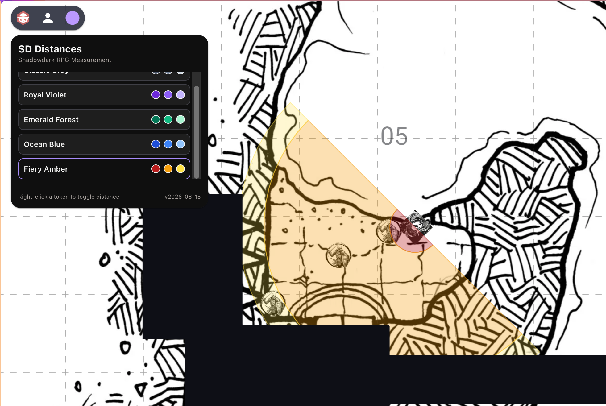

# Distance in the Shadows



An [Owlbear Rodeo](https://owlbear.rodeo) extension for easily measuring Close, Near, and Far distances for Shadowdark RPG tokens.

<!-- markdownlint-disable MD033 -->
<div align="left">
  <a href="https://www.buymeacoffee.com/alvarocavalcanti" target="_blank" style="margin-right: 10px;">
    
  </a>
  <a href="https://ko-fi.com/O4O1WSP5B" target="_blank">
    
  </a>
</div>
<!-- markdownlint-enable MD033 -->

## Description

**Distance in the Shadows** is a helper extension for running Shadowdark RPG on Owlbear Rodeo. It draws native, performance-friendly vector semi-circles indicating Close (5ft), Near (up to 30ft), and Far (+30ft) boundaries directly attached to character, mount, or prop tokens.

## Installation

Add this extension to your [Owlbear Rodeo](https://owlbear.rodeo) profile using the following manifest URL:

```text
https://distanceintheshadows.vercel.app/manifest.json
```

## Features

*   **Context Menu Toggle**: Right-click character, mount, or prop tokens and select **SD Distances** to toggle the measurement template on or off.
*   **Proportional Token Scaling**: Distances scale automatically based on the token's size (treating the token's width as the reference for 5ft). Large creatures automatically project larger reach templates.
*   **Synchronized Rotation**: Drag the standard rotate handle on the Close (inner) semi-circle to rotate the entire template. The Near and Far areas are nested attachments and rotate with it automatically.
*   **Custom Palettes**: Select from 5 different visual color palettes directly in the top extension popover. All active templates on the map update instantly.
*   **Clear Scene Utility**: Quickly clean up all active templates on the map with a single click in the GM tab.

## Color Profiles

1.  **Classic Gray** (Default)
2.  **Royal Violet**
3.  **Emerald Forest**
4.  **Ocean Blue**
5.  **Fiery Amber**
